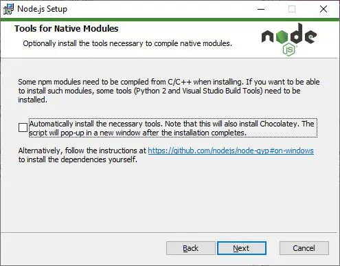
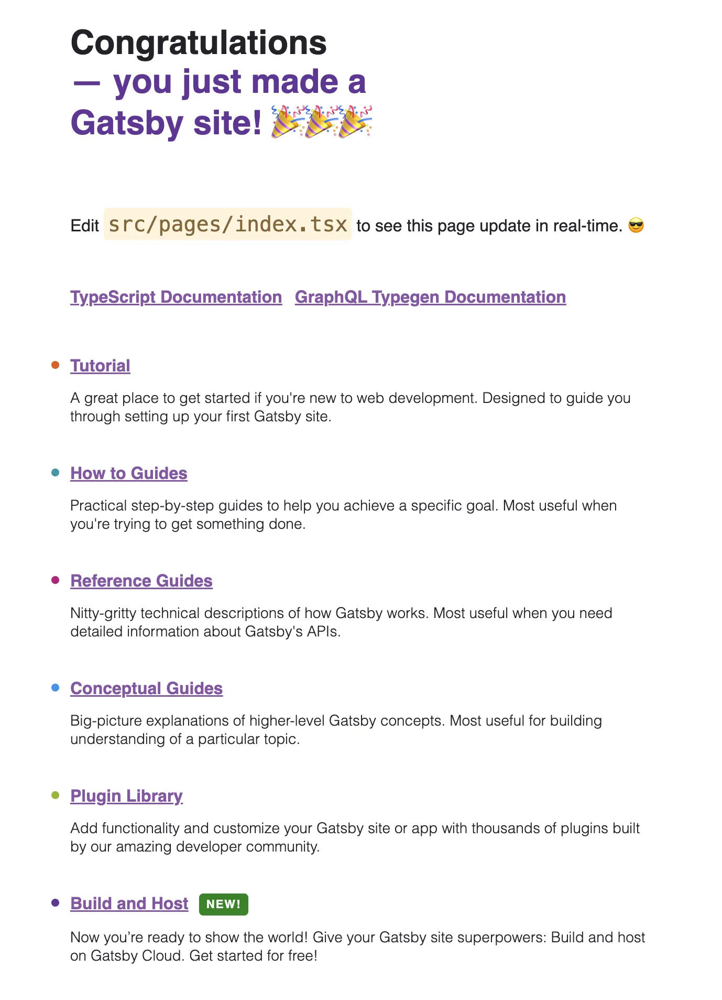

There are three main frameworks that are most popular when creating markdown, md, or mdx-based blogs.

Those are [jekyll](https://jekyllrb-ko.github.io/), [Hugo](https://gohugo.io/), and [Gatsby](https://www.gatsbyjs.com/).

Among them, today we will learn how to create a blog using Gatsby.

---

## 1. Create a Gatsby installation environment

I will explain this separately into macOS and Windows, but if you have already installed each item, please scroll down immediately.

Of course, it is already well organized in [the official document](https://www.gatsbyjs.com/docs/tutorial/getting-started/part-0/#installation-guide), so you can proceed by looking at the official document.

### 1-1-1. [macOS] Installing Node.js

First, let's start by assuming that Homebrew is installed.

If you haven't installed it yet, you can read [this post](/posts/2023/09/en/install-homebrew) and follow along.

With Homebrew installed, open a terminal and run the command below.

(If an error occurs during installation, log back in to the account you used to log in to your Mac on [the Apple site](https://developer.apple.com/download/more/) and proceed again in the terminal.)

When the terminal asks you to agree to the software license, agree and proceed.

```bash
xcode-select --install
```

Afterwards, install node.js using Homebrew.

```bash
brew install node
```

### 1-1-2. [macOS] Installing Git

Since git is a program that developers basically use, you probably already have it installed, but I'll write it down just in case!

```bash
brew install git
```

After installation is complete, register your [Github](https://github.com/) account.

```bash
git config --global user.name "your github name"
git config --global user.email "your github email"
```

### 1-2-1. [Windows] Installing Node.js

Installation on Windows is very simple.

Please visit [the official Site](https://nodejs.org/en) and click the button with LTS.

After that, run the downloaded .exe file.

If this screen appears during installation, click the checkbox and proceed!



### 1-2-2. [Windows] Installing Git

Git is also very simple to install on Windows.

Visit the [the official site](https://gitforwindows.org/) and click the Download button to install and run the .exe file.

### 1-3. Installing gatsby-cli (macOS, Windows)

Now install gatsby command-line-interface.

```bash
npm install -g gatsby-cli
```

When installation is complete, check to see if it was installed properly.

```bash
gatsby --version
# Gatsby CLI version: 5.12.4
# Gatsby version: 5.12.9
```

## 2. Creating a Gatsby project

Now we will finally create the Gatsby project!

You can create it right away using a template that is already in place, but since we are learning today, let's create the project in its initial state!

```bash
# Please move to the folder where you want to create the project and proceed.

gatsby new
```

Please enter your desired blog name.

```bash
What would you like to call your site?
✔ · Classic95's blog
```

Please set the desired project name.

```bash
What would you like to name the folder where your site will be created?
✔ {Current folder name}/ Classic95
```

Please choose between js and ts.

Of course, I chose ts, but if you will continue to follow this article in the future, please select ts. If not, please select your preferred language.

In the future, ts is expected to become established in many places such as open source, collaborative projects, and companies, so we recommend using it!

```bash
Will you be using JavaScript or TypeScript?
  JavaScript
❯ TypeScript
```

This is the part where you select the Content Management System, 
but since the goal of the last part of this post is to distribute it to Github, 
I will choose `No (or I'll add it later)`.

Of course, you can choose the CMS you want later.

```bash
? Will you be using a CMS?
(Single choice) Arrow keys to move, enter to confirm
❯ No (or I'll add it later)
  –
  Contentful
  DatoCMS
  Netlify CMS
  Sanity
  Shopify
  WordPress
```

This is a convenient feature as it automatically configures the gatsby plugin settings when you select the styling system you want.

I chose `styled-components`.

Please choose what you want.

```bash
? Would you like to install a styling system?
(Single choice) Arrow keys to move, enter to confirm
  No (or I'll add it later)
  –
  Emotion
  PostCSS
  Sass
❯ styled-components
  Theme UI
  vanilla-extract
  Tailwind CSS
```

This time, please select the features you want to add when creating the project.

I chose the four below. If you are going to follow these blog posts, I recommend that you choose the same thing I did.

Even if you don't follow them all, be sure to select `Add Markdown and MDX support`!

Of course, don't worry, you can manually set up the plugin later even if you don't select it here!

```bash
? Would you like to install additional features with other plugins?
(Multiple choice) Use arrow keys to move, spacebar to select, and confirm with an enter on "Done"
 ◯ Add the Google gtag script for e.g. Google Analytics
 ◉ Add responsive images
 ◉ Add an automatic sitemap
 ◉ Generate a manifest file
❯◉ Add Markdown and MDX support
 ◯ Add Markdown support (without MDX)
  ─────
  Done
```

Lastly, this is a procedure to check the settings made so far.

If there are no mistakes, please check and enter Yes.

```bash
Thanks! Here's what we'll now do:

    🛠  Create a new Gatsby site in the folder Classic95
    🎨 Get you set up to use styled-components for styling your site
    🔌 Install gatsby-plugin-image, gatsby-plugin-sitemap,
gatsby-plugin-manifest, gatsby-plugin-mdx


? Shall we do this? (Y/n) › Yes
```

## 3. Run Gatsby project

Once installation is complete, enter the commands below.

```bash
cd {your project name}

yarn develop
```

If you enter [http://localhost:8000](http://localhost:8000) into the browser and the screen below appears, it is successful!



---

## Organizing

Today we learned about the Gatsby blog installation environment and how to create and run an initial project.

In the next post, we will learn about the grammar of writing based on mdx.