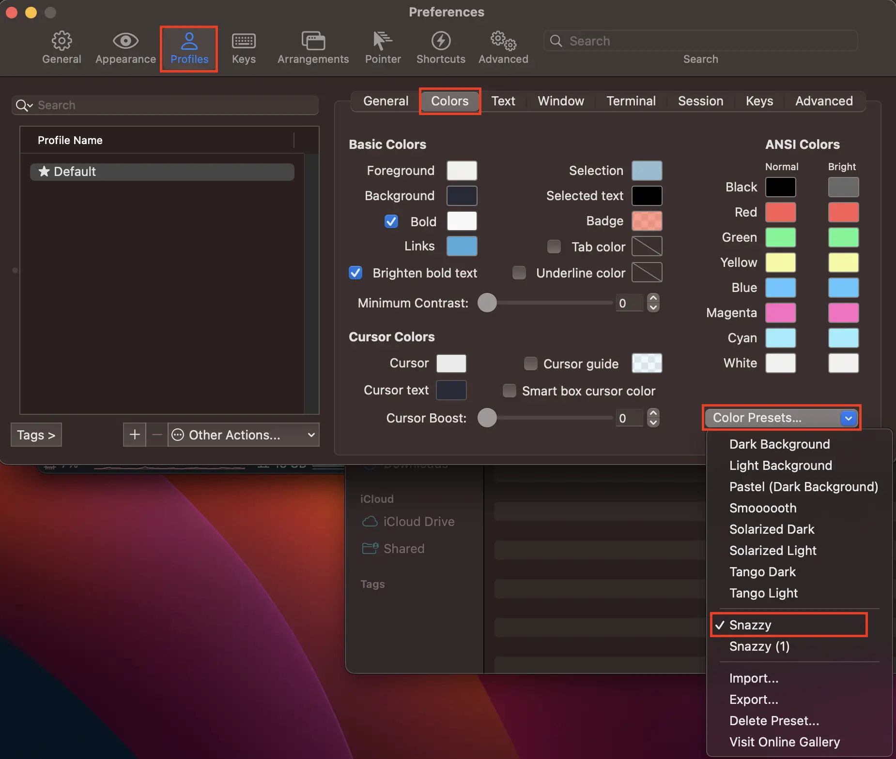
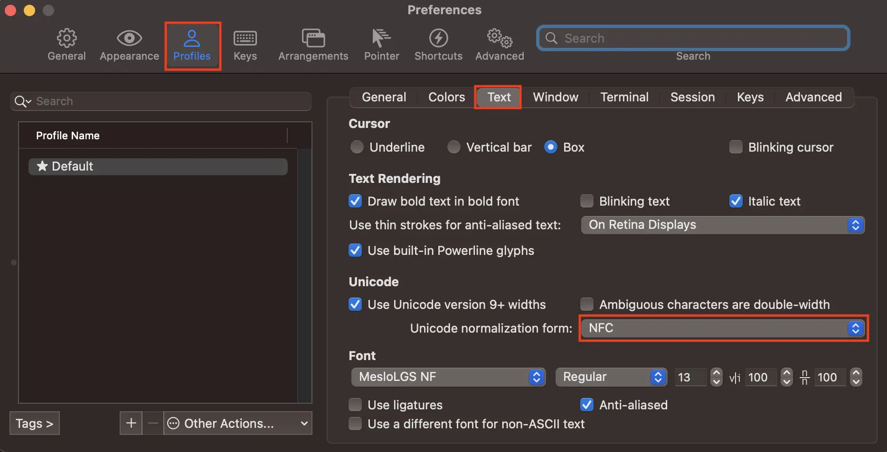
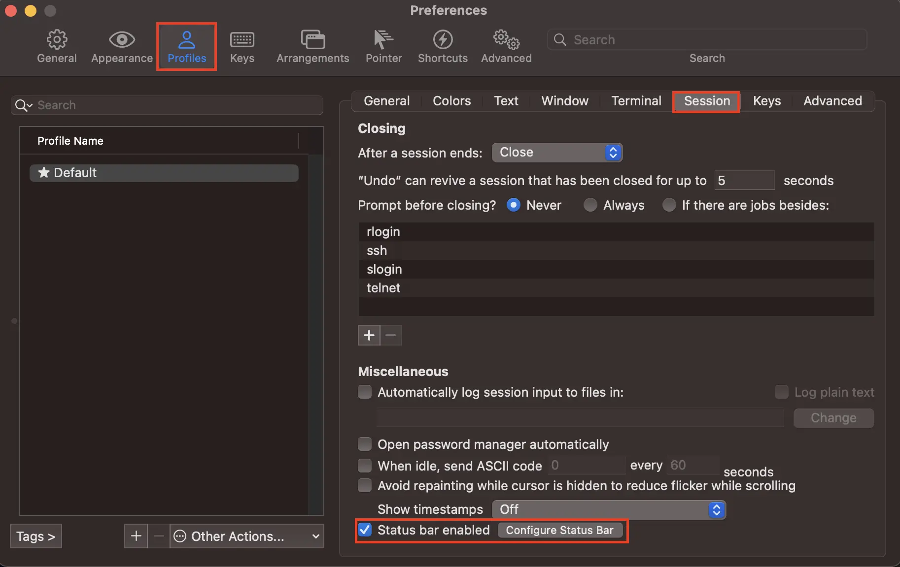
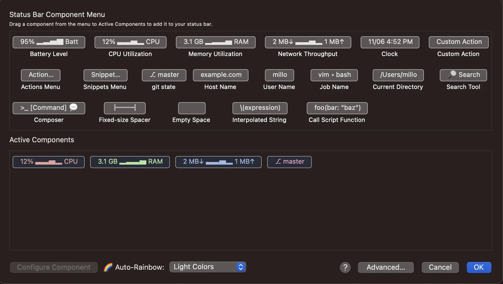
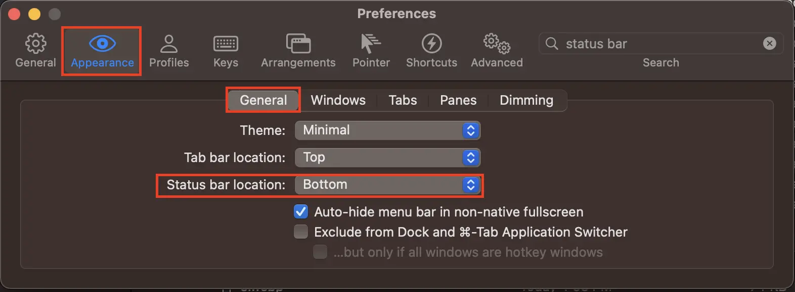

Install iTemr2 on your Mac and create a colorful terminal with oh-my-zsh.

---

## 1. Install iTerm2

I will install it using brew.

If Homebrew is not installed, please install it following [this post](/en/posts/2023/09/install-homebrew) and come back.

Now, enter the command below into the terminal to install it.

```bash
brew install iterm2
```

## 2. Intsall oh-my-zsh

To apply various themes or functions such as autocomplete in iterm2, install oh-my-zsh, one of the zsh (Z shell) plugins.

```bash
sh -c "$(curl -fsSL https://raw.github.com/robbyrussell/oh-my-zsh/master/tools/install.sh)"
```

## 3. Change iterm color scheme and settings

### 3-1. Choose a color scheme

Check and download various color schemes at [the official Site](https://iterm2colorschemes.com/).

Personally, I like pastel tones, so I downloaded and used the Snazzy color scheme below.

<a download="Snazzy.itermcolors" href="/files/2023/09/Snazzy.itermcolors">Download Snazzy Theme</a>

If you download any theme, double-click it and it will automatically be added to iTerm2's iTerm Color Preset.

To check, run iTerm2 and press (⌘ + ,) together.

Then, in the window shown below, select Profile -> Colors -> Color Presets... -> Snazzy (or the downloaded color scheme).



### 3-2. Prevent Hangul from being broken

There are many cases where Hangul is broken in the terminal, so please set the following to prevent Hangul from being broken.

In the window above, change to Profile -> Text -> Unicode normalization form: NFC.



### 3-3. Add status bar

In the window above, check Profile -> Session -> Status bar enabled and click Configure Status Bar on the right.



Then, the window below will appear. Click on the component you want to display in the terminal and click OK.

I am using a total of four: CPU Utilization, Memory Utilization, Network Throughput, and git state.

You can select a color theme from Auto-Rainbow at the bottom, so please select your favorite theme.



I like the status window at the bottom, so I modified it as shown in the image below, but this is personal preference, so feel free to change it.

You can change it at Appearance -> General -> Status bar location.



## 4. Install plugins

Now, let’s install oh-my-zsh’s strongest plugins.

I use the command highlighting plugin (zsh-syntax-highlighting)[https://github.com/zsh-users/zsh-syntax-highlighting] and the autocompletion plugin (zsh-autosuggestions)[https://github.com/zsh-users/zsh-autosuggestions].

```bash
# zsh-syntax-highlighting
git clone https://github.com/zsh-users/zsh-syntax-highlighting.git ${ZSH_CUSTOM:-~/.oh-my-zsh/custom}/plugins/zsh-syntax-highlighting

# zsh-autosuggestions
git clone https://github.com/zsh-users/zsh-autosuggestions.git $ZSH_CUSTOM/plugins/zsh-autosuggestions
```

Once the download is complete, open the ~/.zshrc file and edit it.

```bash
vi ~/.zshrc
```

```bash
# ~/.zshrc
# ...

plugins=(
    # ...
    zsh-syntax-highlighting
    zsh-autosuggestions
    # ...
)

# ...
```

After completing the modifications, apply the modifications with the command below.

```bash
source ~/.zshrc
```

## 5. Choose theme

[Various themes](https://github.com/ohmyzsh/ohmyzsh/wiki/Themes) exist in the iterm2 prompt.

There are several types of the most popular themes, including 
[powerlevel10k](https://github.com/romkatv/powerlevel10k), 
[spaceship](https://spaceship-prompt.sh/), 
and [pure](https://github.com/sindresorhus/pure). 
And I am using powerlevel10k, which has the best performance.

I will install and apply powerlevel10k. You can install and apply other themes in a similar way.

```bash
git clone --depth=1 https://github.com/romkatv/powerlevel10k.git ${ZSH_CUSTOM:-~/.oh-my-zsh/custom}/themes/powerlevel10k
```

After installation is complete, open the ~/.zshrc file and edit the ZSH_THEME entry.

```bash
vi ~/.zshrc
```

Modify the ZSH_THEME part as shown below.

```bash
# ~/.zshrc

# ...

ZSH_THEME="powerlevel10k/powerlevel10k"

# ...
```

After completing the modifications, apply the modifications as follows.

```bash
source ~/.zshrc
```

If you open a new tab after executing the above command, an interactive settings window will pop up and you can set the theme in detail.

If you want to reconfigure, enter p10k configure.

---

## Organizing

Today, we learned how to install the iTerm2 app and add colorful themes and convenient plugins.

These are the things I use and 100% recommend, so I hope they are helpful to you too.

I recommend that everyone use iTerm well and tune it little by little in the direction you want.