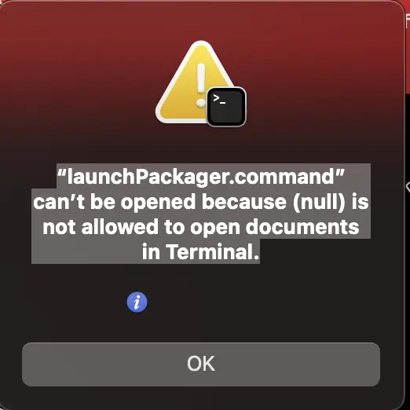
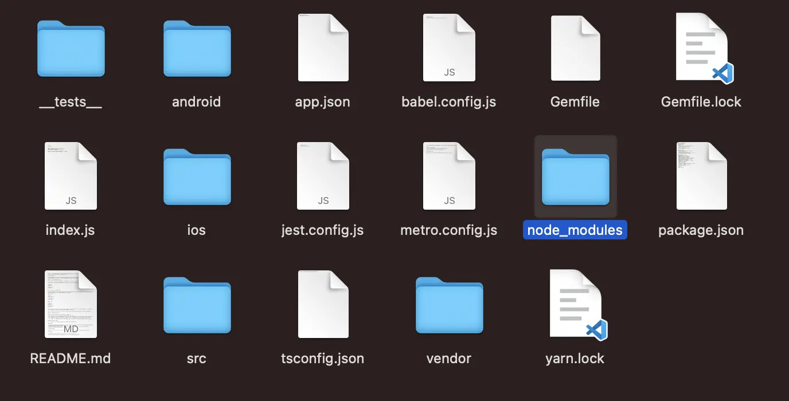
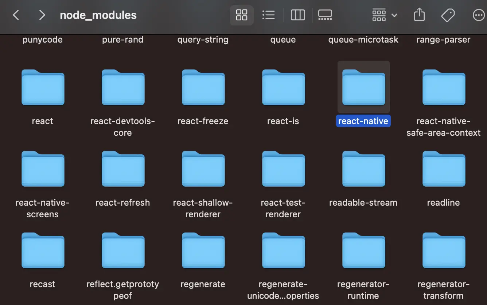
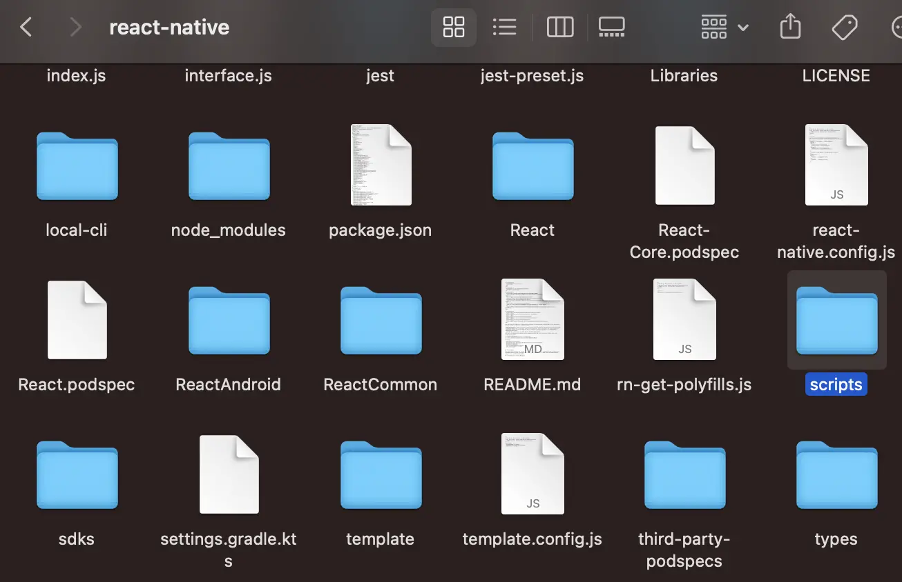
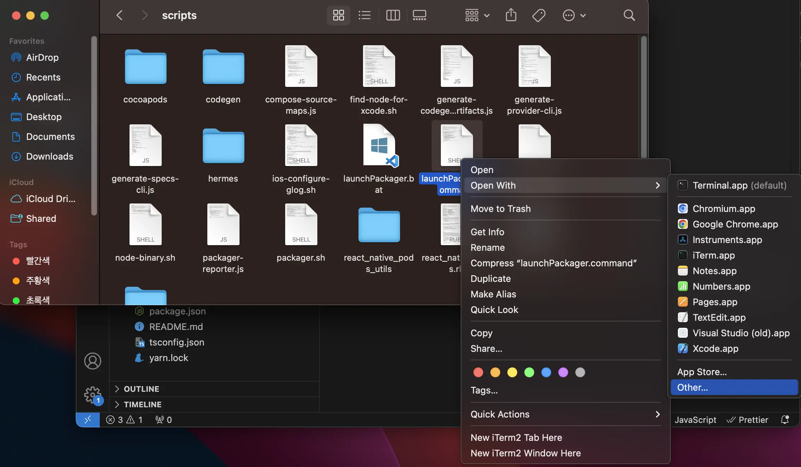
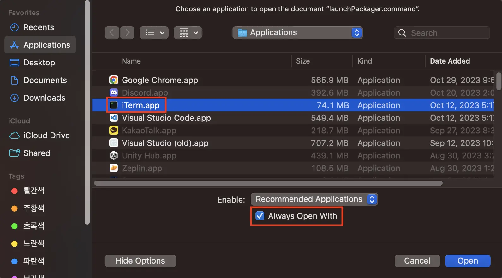
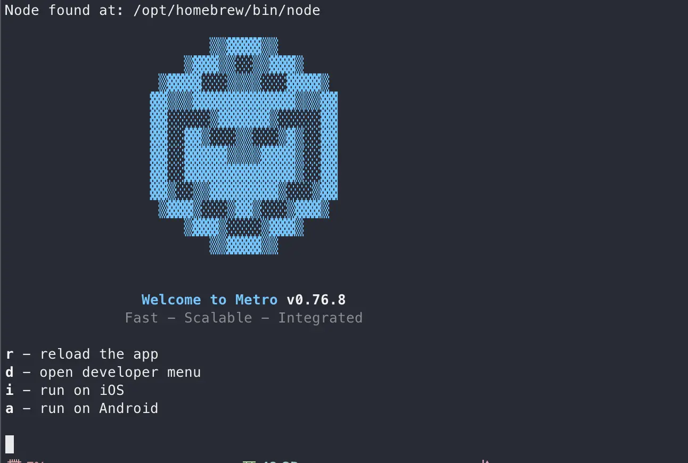

import image from "../../../../images/2023/09/launch-packager-7.webp";



Today, let's learn how to resolve the \"launchPackager.command\" can't be opened error that occurs when running the iOS simulator after react-native version 0.7.

To find out why the error occurs, the problem occurs because you need to run a terminal to run the simulator, but the relevant permissions do not exist.

Now, let’s find out how to solve it.

---

## 1. Resolution

### 1-1. Open node_modules folder inside your project

Open the current project folder and open the node_modules folder.



### 1-2. Open react-native folder inside node_modules

Find and open the react-native folder inside the node_modules folder.



### 1-3. Open scripts folder inside react-native folder 

Find and open the scripts folder inside ./node_modules/react-native folder.



### 1-4. Open launchPackager.command file with other program

Right-click the launchPackager.command file in the ./node_modules/react-native/scripts folder and click Open as shown in the image below.



### 1-5. Open app with iTerm.app

If you do not have iTerm2 installed, please read [this post](/en/posts/2023/09/install-iterm) first.

Set the app as iTerm.app as shown in the image below, click the Always Open With checkbox, and then click Open.



### 1-6. Check out the iTerm app

When you click Open above, check that iTerm is running as shown below and close the window.



### 1-7. Run the ios simulator again

Run the app using your preferred method.

```bash
npm run ios

# or 
# yarn ios
```


---

## Organizing

Today, we learned how to resolve the \"launchPackager.command\" can't be opened error that occurs when running the iOS simulator after react-native version 0.7.

If you follow along with the images, you can solve the problem without much difficulty, so I hope you can solve it by following it step by step.