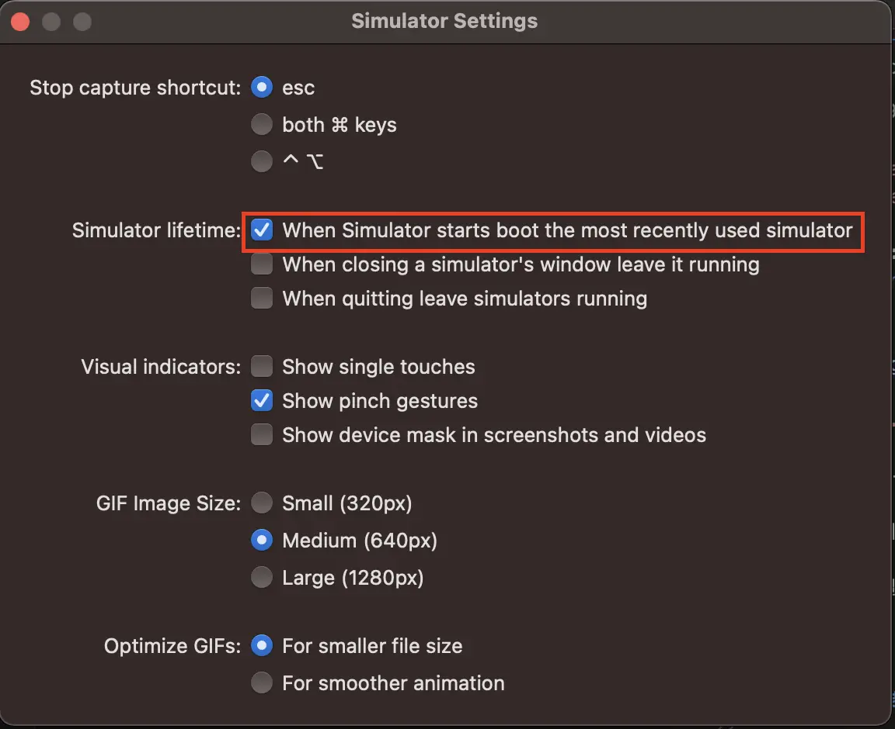

import img1 from "../../../../images/2023/09/boot-1.webp";

Today, we will learn how to resolve the unable to boot device in current state: Booted error that often occurs when running the iOS simulator in react-native.

To find out why the error occurs, the simulator is running.

Now, let’s find out how to solve it.

---

## 1. Resolution

### 1-1. Open ios simulator settings

With the iOS simulator turned on, click Simulator -> Settings... in the menu bar at the top left, as shown in the image below.

Or, while turning on the simulator, press (⌘ + ,) together.

### 1-2. Change Simulator lifetime

As shown in the image below, uncheck \"When Simulator starts boot the most recently used simulator\" in the Simulator lifetime section.

---

## References

- [stack overflow](https://stackoverflow.com/questions/24135067/unable-to-boot-device-in-current-state-booted/71249396#71249396)

---

## Organizing

Today, we learned how to resolve the unable to boot device in current state: Booted error that often occurs when running the iOS simulator in react-native.

If you follow along with the images, you can solve the problem without much difficulty, so I hope you can solve it by following it step by step.